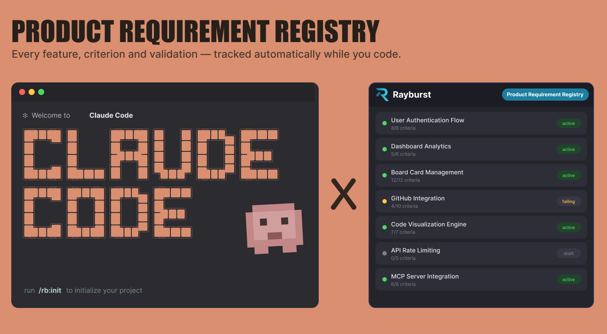

# Rayburst

**Always-on product context for Claude Code.**

[](https://www.npmjs.com/package/@rayburst/cc) [](https://github.com/Dubwoof/rayburst-cc/stargazers) [](https://github.com/Dubwoof/rayburst-cc/commits) [](LICENSE)

<p align="center">
  
</p>

## The Problem

You're building a feature. Claude Code writes the code, but has no idea what the feature is supposed to do. It doesn't know the acceptance criteria. It doesn't know which board card it's working on. Every conversation starts from zero — you re-explain the requirements, the edge cases, the definition of done.

Rayburst connects Claude Code to your **Product Requirement Registry (PRR)** — a structured knowledge graph of features with Gherkin acceptance criteria, managed through [rayburst.app](https://rayburst.app). The plugin makes this context **always available** to Claude without any manual commands.

## What Rayburst Does

Rayburst is a product management platform where you define features and their acceptance criteria. Each feature has:

- A **title** and **description** explaining the user-facing capability
- **Acceptance criteria** in Gherkin format (`Given/When/Then`) — each one atomic and testable
- A **status** (`draft`, `active`, `completed`, `archived`)
- Links to **board cards** (work items), **projects**, **tags**, and **other features**

The `@rayburst/cc` plugin connects Claude Code to your Rayburst organization's PRR so Claude always knows what it's building.

## What the Plugin Does

The plugin is a Claude Code marketplace plugin with two parts:

1. **An MCP server** (stdio) that proxies 25 Rayburst API tools — Claude can read and write features, criteria, board cards, validation reports, tags, and feature links.
2. **Three hooks** that automatically inject product context into every Claude Code session — no slash commands needed.

### Hook 1: SessionStart

Fires once when a Claude Code session starts. Calls the Rayburst API to fetch all features (up to 100) and board cards, then injects them as an XML `<rayburst_product_context>` block via `additionalContext`. This block contains:

- **Six rules** that tell Claude how to work with the PRR (check atlas before coding, flag interference with other features, never modify features without user confirmation, summarize criteria coverage when done)
- **A compact atlas** listing every feature with its ID, status, criteria count, and title (one XML line per feature, capped at 60 features)
- **A board summary** showing cards in `ready`, `in-progress`, and `validation` status with their linked feature IDs

The hook also writes the feature list to a local cache file (`/tmp/rb-features-{hash}.json`) so the other two hooks can read it without making additional API calls.

If no `.claude/rb-config.md` exists or no API key is configured, the hook exits silently — the plugin is invisible until setup.

### Hook 2: UserPromptSubmit

Fires on every user message. Reads the user's prompt from stdin, tokenizes it (removing stop words), and matches the remaining keywords against the cached feature list. Matching uses token overlap scoring with a 0.25 threshold and a bonus for exact title phrase matches.

If one or more features match (up to 3), the hook calls `get_feature` on the Rayburst API for each to load full criteria, then injects an `<rayburst_active_feature>` XML block containing:

- The matched feature(s) with title, status, description
- Every acceptance criterion with its ID, status, title, and full Gherkin description
- A guidance line: "Work against these acceptance criteria"

The hook also writes the primary matched feature to a cache file (`/tmp/rb-active-feature-{hash}.json`) for the PreToolUse hook.

If no features match, the hook clears the active-feature cache and exits silently.

### Hook 3: PreToolUse

Fires when Claude calls `Write` or `Edit` (file creation/modification). Reads the active feature from cache and injects a `<rayburst_coding_reminder>` XML block containing:

- The active feature's name and ID
- A criteria checklist (unchecked `[ ]` items for each criterion)
- The file path being written/edited
- A `<related_features>` warning if the file's name or parent directory appears in the title or description of other features in the atlas

This hook makes zero API calls — it reads only from local cache files. It never blocks the tool call; it only adds context.

### MCP Server

A Node.js stdio server built with `@modelcontextprotocol/sdk` that proxies the Rayburst HTTP API. It reads `RAYBURST_API_KEY` from environment variables or `.claude/rb-config.md`, and calls `https://api.rayburst.app/api/v1/mcp` using JSON-RPC 2.0 over HTTP with Bearer auth.

The server uses a lazy client pattern — it doesn't connect to the API at startup, only on the first tool call. This means the server starts even if the API key isn't configured yet.

**25 tools across 8 domains:**

| Domain | Tools | What they do |
|--------|-------|-------------|
| **Ping** | `rb_ping` | Health check — tests API connectivity via MCP initialize handshake |
| **Features** | `rb_list_features`, `rb_get_feature`, `rb_create_feature`, `rb_update_feature`, `rb_delete_feature` | CRUD on features. List supports filtering by project, status, search text, and tags. Create requires title + projectIds. |
| **Criteria** | `rb_add_criterion`, `rb_update_criterion`, `rb_delete_criterion` | Manage acceptance criteria on features. Add requires featureId + description (Gherkin). Supports validation method (`manual`, `browser`, `code-review`). |
| **Board/Cards** | `rb_list_boards`, `rb_list_cards`, `rb_get_card`, `rb_create_card`, `rb_update_card`, `rb_move_card` | Board and card management. Cards have statuses: `draft`, `ready`, `in-progress`, `validation`, `done`. Get returns card with roles, todos, and dependencies. |
| **Card Extras** | `rb_list_card_features`, `rb_list_card_todos`, `rb_list_card_roles`, `rb_add_comment` | Read linked features/todos/roles on a card, post markdown comments. |
| **Links** | `rb_link_feature_to_feature`, `rb_list_feature_links` | Create typed links between features (`depends_on`, `implements`, `extends`, `related_to`). |
| **Validation** | `rb_submit_validation` | Submit a structured validation report for a card or feature with per-criterion pass/fail/blocked/skipped results. |
| **Tags** | `rb_list_tags`, `rb_create_tag` | Manage org-wide tags (18 color options) used to categorize features and criteria. |

Claude decides when to call these tools based on the rules injected by the SessionStart hook. The user never needs to invoke them manually.

## Install

**Prerequisites:** Claude Code v1.0.33+ and a [Rayburst](https://rayburst.app) account with an API key.

```bash
claude plugin add Dubwoof/rayburst-cc
```

Restart Claude Code, then run the one-time setup:

```
/rb:init
```

This prompts for:
- **Rayburst API key** — get one at [https://www.rayburst.app/profile?tab=mcp-agents](https://www.rayburst.app/profile?tab=mcp-agents) (starts with `rb_user_`)
- **Project URL** — the base URL of your running app (e.g. `http://localhost:3000`)
- **Board** — picks from your org's boards via the API
- **Project IDs** — frontend and backend project UUIDs
- **User credentials** — username/password for browser-based validation (passwords can reference env vars with `$VAR_NAME`)

Config is saved to `.claude/rb-config.md`. **Add this to `.gitignore`** — it contains your API key.

That's it. Every Claude Code session in this project now has product context automatically.

## How a Session Looks

```
You: Help me implement the dark mode toggle

  SessionStart hook already injected the atlas (45 features, 12 board cards)
  UserPromptSubmit hook matches "Dark Mode Toggle" feature, loads 5 criteria

Claude: I see "Dark Mode Toggle" in your feature atlas with 5 acceptance criteria:
  1. Given the user is on settings, When they toggle dark mode, Then all UI switches to dark theme
  2. Given dark mode is active, When the user refreshes, Then dark mode persists
  3. Given no preference is set, When the app loads, Then it detects the OS theme
  4. Given dark mode is active, When viewing any page, Then all components use dark colors
  5. Given dark mode is toggled, When another tab is open, Then it syncs

Let me implement against these.

  Claude calls Edit on src/theme.ts
  PreToolUse hook injects criteria checklist + "also relates to Accessibility High Contrast"

Claude: Updated src/theme.ts for theme persistence (criterion #2).
Note: this file also relates to "Accessibility High Contrast" —
my changes don't affect contrast ratio logic.

  Claude finishes

Claude: Implementation complete. Criteria addressed:
  - [x] Settings toggle (#1)
  - [x] Persists on refresh (#2)
  - [x] OS theme detection (#3)
  - [x] All components (#4)
  - [ ] Cross-tab sync (#5) — needs SharedWorker, skipped

Would you like me to update the criteria statuses in the atlas?
```

## Configuration

The plugin reads config from two sources (env vars take priority):

| Source | Fields |
|--------|--------|
| `RAYBURST_API_KEY` | API key (overrides config file) |
| `RAYBURST_API_URL` | API endpoint (default: `https://api.rayburst.app/api/v1/mcp`) |
| `RAYBURST_AGENT_ID` | Optional agent ID for the `X-Agent-Id` header |
| `.claude/rb-config.md` | API key, API URL, project URL, board ID/slug, project IDs, user credentials |

The hooks read `.claude/rb-config.md` from `$CLAUDE_PROJECT_DIR` (the directory where Claude Code was launched).

## API Key Security

- Keys are **scoped to one user + one organization** — a key cannot access other orgs
- Three types: `rb_user_` (human users), `rb_agent_` (AI agents), `rb_global_` (org admins)
- Stored in `.claude/rb-config.md` — must be gitignored
- Create at [rayburst.app/settings/api-keys](https://www.rayburst.app/settings/api-keys)

## File Structure

```
rayburst-cc/
  .claude-plugin/plugin.json    Plugin manifest — declares MCP server + skills
  .mcp.json                     MCP server declaration (stdio)
  start.mjs                     Bootstrapper — installs deps, loads server bundle
  server.bundle.mjs             Bundled MCP server (esbuild, 340kb)
  src/
    server.ts                   MCP server entry — registers 25 tools, stdio transport
    api-client.ts               HTTP client — JSON-RPC 2.0 over fetch with SSE parsing
    tools/
      ping.ts                   rb_ping
      features.ts               rb_list/get/create/update/delete_feature
      criteria.ts               rb_add/update/delete_criterion
      board.ts                  rb_list_boards/cards, rb_get/create/update/move_card, rb_list_card_*
      links.ts                  rb_link_feature_to_feature, rb_list_feature_links
      validation.ts             rb_submit_validation
      tags.ts                   rb_list_tags, rb_create_tag
      comments.ts               rb_add_comment
  hooks/
    hooks.json                  Hook registrations (SessionStart, UserPromptSubmit, PreToolUse)
    sessionstart.mjs            Fetches atlas + board, injects <rayburst_product_context>
    userpromptsubmit.mjs        Matches prompt to features, injects <rayburst_active_feature>
    pretooluse.mjs              On Write/Edit, injects <rayburst_coding_reminder>
    rb-cache.mjs                Shared: config parsing, API calls, /tmp caching, keyword matching
    product-context-block.mjs   Shared: XML block builders for all 3 hooks
  skills/
    init/SKILL.md               /rb:init — one-time project setup (only slash command)
```

## Uninstall

```bash
claude plugin remove rayburst
rm .claude/rb-config.md
```

## Contributing

```bash
git clone https://github.com/Dubwoof/rayburst-cc.git
cd rayburst-cc && npm install && npm run build
```

Test locally:

```bash
claude plugin add /path/to/rayburst-cc
```

## License

MIT
